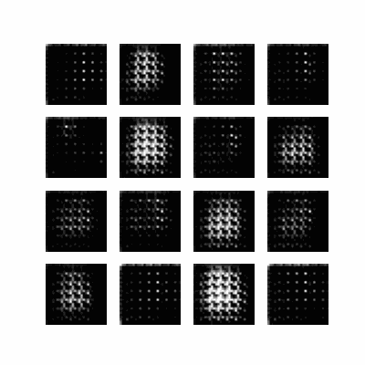

# DCGAN On Fashion Mnist
## This task solved with this repo
- Fashion Mnist Generator: I trained a DCGAN on [Fashion Mnist Dataset](https://keras.io/api/datasets/fashion_mnist/)


## How to install
### Run this command:
```bash
pip install -r requirements.txt
```
# Fashion Mnist
### Fashion Mnist Training Duration

<br>
*you can download the weight of it from [here](https://drive.google.com/drive/folders/1A1Hrwt5GCbNlXYQiwK7n-OMlYUIqP2bV?usp=sharing) if you want to.*
